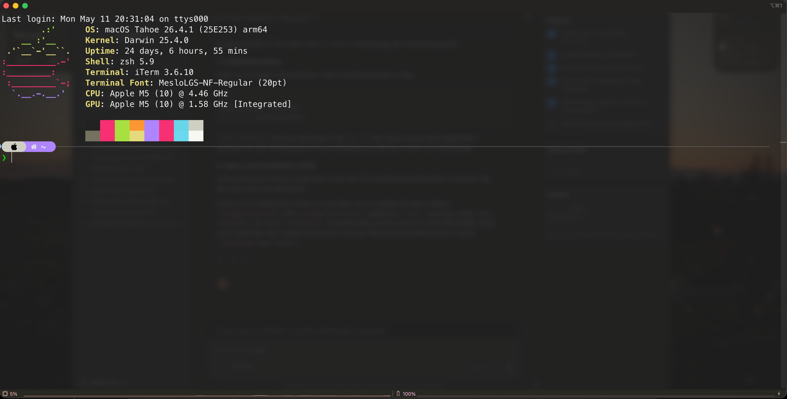

# macOS Setup Guide

A personal, reproducible setup for a fresh Mac — terminal, editor, languages, and dotfiles all in one place.

> **Goal:** open a brand-new Mac, follow this README top-to-bottom, end up with the same environment I had on the last machine.



*iTerm2 + Powerlevel10k + Fastfetch on macOS 26.4 (Apple M5).*

---

## Table of contents

1. [Prerequisites](#1-prerequisites)
2. [Homebrew](#2-homebrew)
3. [iTerm2](#3-iterm2)
4. [Oh My Zsh](#4-oh-my-zsh)
5. [Powerlevel10k](#5-powerlevel10k)
6. [Nerd Fonts (for icons in the prompt)](#6-nerd-fonts)
7. [Fastfetch](#7-fastfetch)
8. [VS Code](#8-vs-code)
9. [Git](#9-git)
10. [Python](#10-python)
11. [LaTeX](#11-latex)
12. [Restoring configs from this repo](#12-restoring-configs-from-this-repo)
13. [Useful links](#useful-links)

---

## 1. Prerequisites

Install the **Xcode Command Line Tools** — needed by Homebrew, Git, and most compilers.

```bash
xcode-select --install
```

A dialog will pop up. Accept it and wait a few minutes. Verify:

```bash
xcode-select -p
# /Library/Developer/CommandLineTools
```

---

## 2. Homebrew

[Homebrew](https://brew.sh) is the package manager for macOS — almost everything else on this list installs through it.

### Install

```bash
/bin/bash -c "$(curl -fsSL https://raw.githubusercontent.com/Homebrew/install/HEAD/install.sh)"
```

### Add to your shell

On Apple Silicon Macs, Homebrew installs to `/opt/homebrew`. Add it to your PATH:

```bash
echo 'eval "$(/opt/homebrew/bin/brew shellenv)"' >> ~/.zprofile
eval "$(/opt/homebrew/bin/brew shellenv)"
```

### Verify

```bash
brew doctor
brew --version
```

> 💡 **Tip:** Once you've finished setting up, run `brew bundle dump --file=~/Brewfile` to snapshot every package you've installed. Drop that `Brewfile` into [`configs/`](./configs/) and you can recreate your whole setup with `brew bundle --file=Brewfile`.

---

## 3. iTerm2

[iTerm2](https://iterm2.com/) is a much-improved replacement for the default macOS Terminal — true color, split panes, better search, profile sync.

### Install

```bash
brew install --cask iterm2
```

### Restore my config

Two options — both work, pick one.

**Option A — Export / Import archive (simplest, recommended):**

On the **old** Mac:
1. Open iTerm2 → **Settings (⌘,) → General → Settings**.
2. Click **Export All Settings and Data** → save the `.itermexport` file.
3. Drop it into [`configs/iterm2/`](./configs/iterm2/) in this repo.

On the **new** Mac, after installing iTerm2:
1. Open iTerm2 → **Settings → General → Settings**.
2. Click **Import All Settings and Data** → pick [`configs/iterm2/iterm2-settings.itermexport`](./configs/iterm2/iterm2-settings.itermexport).
3. Restart iTerm2 — every profile, key binding, color scheme, snippet, and pref is restored.

**Option B — Sync from a folder (good if you want plain-text diffs):**

1. Copy `com.googlecode.iterm2.plist` somewhere stable, e.g. `~/Documents/iterm2-config/`.
2. Open iTerm2 → **Settings → General → Settings**.
3. Check **Load preferences from a custom folder or URL** and point it at that folder.
4. Choose **Save changes to folder when iTerm2 quits** so the repo stays in sync.

> 📁 *Config in this repo:* [`configs/iterm2/iterm2-settings.itermexport`](./configs/iterm2/iterm2-settings.itermexport)

---

## 4. Oh My Zsh

[Oh My Zsh](https://ohmyz.sh/) manages plugins, themes, and aliases for the `zsh` shell that ships with macOS.

### Install

```bash
sh -c "$(curl -fsSL https://raw.githubusercontent.com/ohmyzsh/ohmyzsh/master/tools/install.sh)"
```

This creates `~/.oh-my-zsh/` and replaces your `~/.zshrc` (the old one is backed up automatically).

### Plugins I use

```bash
# zsh-autosuggestions — greys out a suggested completion as you type
git clone https://github.com/zsh-users/zsh-autosuggestions \
  ${ZSH_CUSTOM:-~/.oh-my-zsh/custom}/plugins/zsh-autosuggestions

# zsh-syntax-highlighting — colours commands red/green as you type them
git clone https://github.com/zsh-users/zsh-syntax-highlighting \
  ${ZSH_CUSTOM:-~/.oh-my-zsh/custom}/plugins/zsh-syntax-highlighting
```

Then the `plugins=(...)` line in `~/.zshrc` looks like this:

```zsh
plugins=(git
         zsh-autosuggestions
         zsh-syntax-highlighting
         vscode)
```

The `vscode` plugin (built into Oh My Zsh) adds aliases like `vsc .` to open the current folder. The `git` plugin adds dozens of git aliases like `gst` for `git status`.

My `~/.zshrc` also runs `neofetch` automatically when a new terminal opens — that's the line at the very bottom of the file.

> 📁 *Config in this repo:* [`configs/zsh/.zshrc`](./configs/zsh/.zshrc)

---

## 5. Powerlevel10k

[Powerlevel10k](https://github.com/romkatv/powerlevel10k) is the prompt theme — fast, configurable, shows git status, virtualenv, exit codes, etc.

### Install

```bash
git clone --depth=1 https://github.com/romkatv/powerlevel10k.git \
  ${ZSH_CUSTOM:-$HOME/.oh-my-zsh/custom}/themes/powerlevel10k
```

### Activate

In `~/.zshrc`, set:

```zsh
ZSH_THEME="powerlevel10k/powerlevel10k"
```

Restart iTerm2. The configuration wizard launches automatically the first time. To re-run it later:

```bash
p10k configure
```

This writes `~/.p10k.zsh`, which is the file you save to share your prompt across machines.

> 📁 *Config in this repo:* [`configs/zsh/.p10k.zsh`](./configs/zsh/.p10k.zsh)

---

## 6. Nerd Fonts

Powerlevel10k and many neofetch styles need a font with extra glyphs (folder icons, git branch, OS logos).

```bash
brew install --cask font-meslo-lg-nerd-font
```

Then in **iTerm2 → Settings → Profiles → Text → Font**, pick `MesloLGS NF` (or whichever variant you prefer). Set it for both **Font** and **Non-ASCII Font**.

Other good options: `font-fira-code-nerd-font`, `font-jetbrains-mono-nerd-font`, `font-hack-nerd-font`.

---

## 7. Fastfetch

[Fastfetch](https://github.com/fastfetch-cli/fastfetch) prints a colored Apple logo and your system specs every time you open a terminal. It's the actively-maintained successor to [Neofetch](https://github.com/dylanaraps/neofetch), which was archived in 2024. Fastfetch starts noticeably faster (written in C, not bash) and tracks new macOS versions and Apple Silicon chips properly.

### Install

```bash
brew install fastfetch
```

### Where the config lives

Fastfetch reads `~/.config/fastfetch/config.jsonc`. The config in this repo is a slimmed-down version showing OS, Kernel, Uptime, Shell, Terminal, Terminal Font, CPU, and GPU, with the small macOS logo and color blocks underneath — matching the look from my previous neofetch setup.

To install it:

```bash
mkdir -p ~/.config/fastfetch
cp configs/fastfetch/config.jsonc ~/.config/fastfetch/config.jsonc
fastfetch     # test it
```

Generate a fresh starter config (with every option commented) if you want to customize further:

```bash
fastfetch --gen-config
```

> 📁 *Config in this repo:* [`configs/fastfetch/config.jsonc`](./configs/fastfetch/config.jsonc)

> 💡 `fastfetch` is already set to run on terminal start in my `.zshrc` (last line of the file).

### Migrating from neofetch

If you previously had neofetch installed:

```bash
brew uninstall neofetch
rm -rf ~/.config/neofetch
```

Then update the last line of `~/.zshrc` from `neofetch` to `fastfetch` and open a new terminal.

---

## 8. VS Code

### Install

```bash
brew install --cask visual-studio-code
```

### Enable the `code` command

After first launch, open the Command Palette (⇧⌘P) and run:

> **Shell Command: Install 'code' command in PATH**

Now `code .` opens the current folder from any terminal.

### Restore everything via Settings Sync (recommended)

VS Code's built-in **Settings Sync** handles the full restore automatically — settings, keybindings, snippets, tasks, the extensions list with their per-extension settings, UI state, and profiles.

1. Open VS Code → click the ⚙️ (gear, bottom-left) → **Settings Sync...**
2. Sign in with **GitHub** or **Microsoft** (the same account you used on the previous Mac).
3. Pick what to sync (defaults are fine — settings + keybindings + extensions + UI state).
4. Wait ~30 seconds. Done.

That's the entire VS Code section of a fresh-Mac install when Settings Sync is enabled.

### The files in `configs/vscode/` are a backup snapshot

Even with Settings Sync, the committed files matter — they're the version-controlled record of every choice, readable on GitHub without launching VS Code:

- [`configs/vscode/settings.json`](./configs/vscode/settings.json)
- [`configs/vscode/keybindings.json`](./configs/vscode/keybindings.json)
- [`configs/vscode/extensions.txt`](./configs/vscode/extensions.txt) — output of `code --list-extensions`

If Settings Sync is ever unavailable or you'd rather not sign in, apply them manually:

```bash
cp configs/vscode/settings.json    "$HOME/Library/Application Support/Code/User/settings.json"
cp configs/vscode/keybindings.json "$HOME/Library/Application Support/Code/User/keybindings.json"
xargs -n1 code --install-extension < configs/vscode/extensions.txt
```

### What's in my settings (the highlights)

- **Themes:** *Monokai Classic* (dark) / *Atom One Light* (light) — auto-switches with system appearance via `auto-dark-mode-windows`.
- **Font:** `MesloLGS NF` at 13pt, line-height 1.5 — same Nerd Font as the terminal so glyphs render in both.
- **Format on save** with `autopep8` for Python.
- **Word wrap** on, **minimap / breadcrumbs / hover popups** off — minimalist editing surface.
- **Spell-check** for Norwegian Bokmål + English (`cSpell.language: "nb,nb-NO,en"`) with a custom dictionary of physics terms.
- **Code Runner** rebound from `Ctrl+Alt+N` to **`Alt+R`**, with `python` set to `python3`.
- **`Cmd+B`** toggles the **Auxiliary Bar** (right-side panel), **`Alt+B`** toggles the **Sidebar**.
- **LaTeX Workshop** auto-builds on save; PDF opens via `latex-workshop-pdf-hook`.

### Terminal integration with iTerm2 / Powerlevel10k

Already configured in [`settings.json`](./configs/vscode/settings.json):

```jsonc
"terminal.integrated.fontFamily": "MesloLGS NF",
"terminal.integrated.defaultProfile.osx": "zsh",
"terminal.external.osxExec": "iTerm2.app"
```

That last line means *Open in External Terminal* (⇧⌘C) launches iTerm2 instead of Apple's Terminal.app.

### Keeping the snapshot fresh

Settings Sync handles the live state, but if you want the committed files to stay in sync (so the GitHub view of the repo reflects your current setup), refresh them once in a while:

```bash
cp "$HOME/Library/Application Support/Code/User/settings.json"    configs/vscode/settings.json
cp "$HOME/Library/Application Support/Code/User/keybindings.json" configs/vscode/keybindings.json
code --list-extensions > configs/vscode/extensions.txt
```

Then commit the diff.

---

## 9. Git

### Install

Git ships with the Xcode CLI tools, but installing through Homebrew gets you a newer version:

```bash
brew install git
```

### Configure identity

```bash
git config --global user.name "Your Name"
git config --global user.email "you@example.com"
git config --global init.defaultBranch main
git config --global pull.rebase false
```

### SSH key for GitHub

```bash
ssh-keygen -t ed25519 -C "you@example.com"
eval "$(ssh-agent -s)"
ssh-add --apple-use-keychain ~/.ssh/id_ed25519
pbcopy < ~/.ssh/id_ed25519.pub
```

Paste into [github.com → Settings → SSH and GPG keys](https://github.com/settings/keys).

> 📁 *Config in this repo:* [`configs/.gitconfig`](./configs/.gitconfig)

---

## 10. Python

**The rule that fixes 90% of Python pain on macOS:** install Python once via Homebrew, never `pip install` anything globally, and create a virtual environment for every project.

### Step 1 — Install Python

```bash
brew install python
```

This puts `python3` at `/opt/homebrew/bin/python3`. The system Python at `/usr/bin/python3` is for macOS itself — leave it alone.

Verify:

```bash
python3 --version          # → Python 3.x.x
which python3              # → /opt/homebrew/bin/python3
pip3 --version
```

### Step 2 — One venv per project

For every project (no exceptions, even tiny scripts):

```bash
cd ~/code/my-project

# create a virtual environment in .venv/
python3 -m venv .venv

# activate it — your prompt now shows the venv name in parentheses
source .venv/bin/activate

# install whatever this project needs, INTO the venv
pip install numpy matplotlib jupyterlab

# work on the project ...

# when you're done with this terminal:
deactivate
```

Three things to remember once you've done this a few times:

1. **`source .venv/bin/activate`** is the only command that varies. The rest is `pip install` like normal — but everything goes into `.venv/` instead of polluting the system Python.
2. **Add `.venv/` to your project's `.gitignore`** — it's machine-specific and rebuildable.
3. **Pin versions before sharing or deploying:**
   ```bash
   pip freeze > requirements.txt
   ```
   On a fresh checkout: `pip install -r requirements.txt`.

### Why no global pip installs?

Different projects need different versions of `numpy`, `pandas`, etc. Installing into one shared Python guarantees a dependency conflict eventually, and on macOS it can also break Homebrew or system tools. Venvs cost about 3 seconds to create and remove the entire class of problem.

If you ever see "this would break system packages — use --break-system-packages" when running pip, that's macOS / Homebrew telling you to make a venv. Listen to it.

### Optional: jupyter inside a venv

If you use Jupyter notebooks, install it inside the project's venv too:

```bash
source .venv/bin/activate
pip install jupyterlab ipykernel
python -m ipykernel install --user --name=my-project
jupyter lab
```

The `ipykernel install` line registers the venv as a kernel choice in JupyterLab.

### Worth knowing — modern alternatives

- [**`uv`**](https://docs.astral.sh/uv/) — newer, dramatically faster, replaces `pip` + `venv` + version management in one tool. If I were starting from zero today, this is what I'd use:
  ```bash
  brew install uv
  uv python install 3.12
  uv venv && source .venv/bin/activate
  uv pip install numpy matplotlib
  ```
  Same mental model as `python -m venv` + `pip install` — just faster and with better lockfiles.
- [**`pyenv`**](https://github.com/pyenv/pyenv) — install and switch between multiple Python versions side-by-side. Useful when one project needs 3.10 and another needs 3.12.
- [**`conda` / `mamba`**](https://github.com/conda-forge/miniforge) — best when you need scientific stacks with heavy non-Python dependencies (CUDA, MKL, large compiled libraries). Overkill for most general use.

---

## 11. LaTeX

### Install MacTeX (what I use)

The simplest path is the official MacTeX installer — a single `.pkg` that puts everything you need on disk in one go.

1. Download from https://www.tug.org/mactex/mactex-download.html (~6 GB)
2. Double-click `MacTeX.pkg` → follow the installer prompts
3. Restart your terminal so `pdflatex`, `xelatex`, and `latexmk` end up on `PATH`
4. Verify:
   ```bash
   which latexmk
   pdflatex --version
   ```

This installs the full TeX Live distribution plus GUI apps (TeXShop, BibDesk, LaTeXiT). Editing happens in VS Code via LaTeX Workshop; the GUI apps are mostly there as fallback.

> 💡 **Why not Homebrew?** `brew install --cask mactex` works too and pulls the same package, but the official `.pkg` is more reliable for the initial install — you get Apple's installer UI, signed packages, and progress feedback for a 6 GB download. After that, `tlmgr` (the TeX Live manager) handles updates from inside the install.

### Update packages

```bash
sudo tlmgr update --self
sudo tlmgr update --all
```

### Smaller alternative (if disk space matters)

[BasicTeX](https://www.tug.org/mactex/morepackages.html) is ~100 MB and you `tlmgr install` what you need on demand:

```bash
brew install --cask basictex
sudo tlmgr update --self
sudo tlmgr install latexmk collection-fontsrecommended
```

### VS Code integration

Already in [`extensions.txt`](./configs/vscode/extensions.txt) and [`settings.json`](./configs/vscode/settings.json):

- **`james-yu.latex-workshop`** — auto-builds on save (`latex-workshop.latex.autoBuild.run: "onSave"`), opens the PDF inside VS Code, supports SyncTeX (Alt+E to jump to source from the PDF — that's a custom keybinding in [`keybindings.json`](./configs/vscode/keybindings.json)).
- Error/warning popups are turned off (`latex-workshop.message.error.show: false`) so build failures don't spam notifications — check the Problems panel instead.

---

## 12. Restoring configs from this repo

The fast path on a fresh Mac, after Homebrew, Oh My Zsh and Powerlevel10k are installed (sections 2, 4, 5):

```bash
# 1. reinstall every brew package + cask + vscode extension in one shot
brew bundle --file=configs/Brewfile

# 2. shell + prompt
cp configs/zsh/.zshrc      ~/.zshrc
cp configs/zsh/.p10k.zsh   ~/.p10k.zsh

# 3. neofetch
mkdir -p ~/.config/neofetch
cp configs/neofetch/config.conf ~/.config/neofetch/config.conf

# 4. VS Code — easiest path: open it and sign in to Settings Sync.
#    (Manual fallback if you'd rather not sign in:)
# cp configs/vscode/settings.json    "$HOME/Library/Application Support/Code/User/settings.json"
# cp configs/vscode/keybindings.json "$HOME/Library/Application Support/Code/User/keybindings.json"
# xargs -n1 code --install-extension < configs/vscode/extensions.txt

# 5. Git
cp configs/.gitconfig ~/.gitconfig

# 6. reload the shell
source ~/.zshrc
```

For **iTerm2**: open it once, then **Settings → General → Settings → Import All Settings and Data** → pick `configs/iterm2/iterm2-settings.itermexport`.

For **MacTeX**: download `MacTeX.pkg` from https://www.tug.org/mactex/ and run it manually (see [section 11](#11-latex)). Not in the Brewfile by design — the .pkg installer is the more reliable route for the 6 GB download.

> 💡 The `Brewfile` already includes every VS Code extension with `vscode "..."` lines, so step 4's `xargs` line is redundant if you've run step 1 — pick whichever you prefer.

---

## Useful links

- Homebrew docs — https://docs.brew.sh
- iTerm2 docs — https://iterm2.com/documentation.html
- Oh My Zsh wiki — https://github.com/ohmyzsh/ohmyzsh/wiki
- Powerlevel10k — https://github.com/romkatv/powerlevel10k
- Nerd Fonts — https://www.nerdfonts.com
- Neofetch wiki — https://github.com/dylanaraps/neofetch/wiki
- fastfetch — https://github.com/fastfetch-cli/fastfetch
- VS Code docs — https://code.visualstudio.com/docs
- pyenv — https://github.com/pyenv/pyenv
- uv — https://docs.astral.sh/uv/
- MacTeX — https://www.tug.org/mactex/
- LaTeX Workshop — https://github.com/James-Yu/LaTeX-Workshop

---

*Last updated: 2026-05-07*
